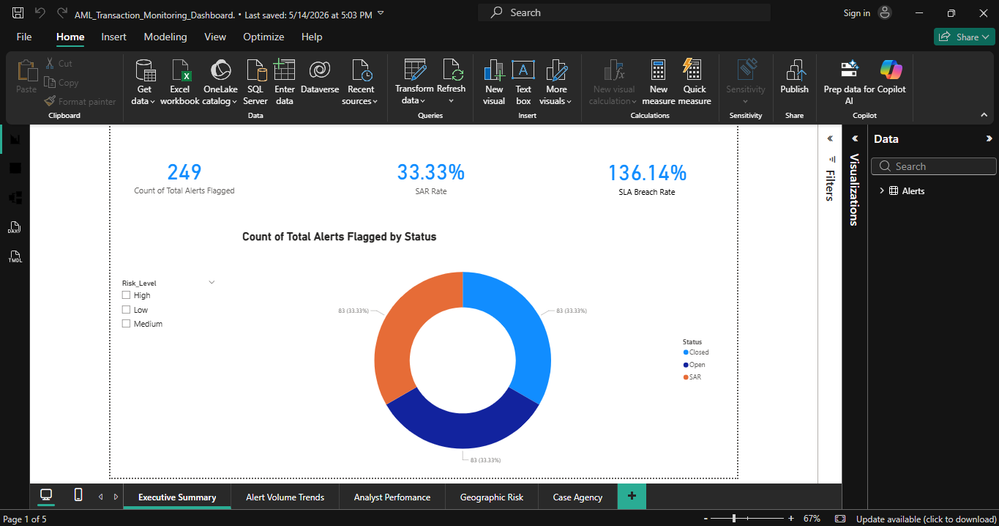
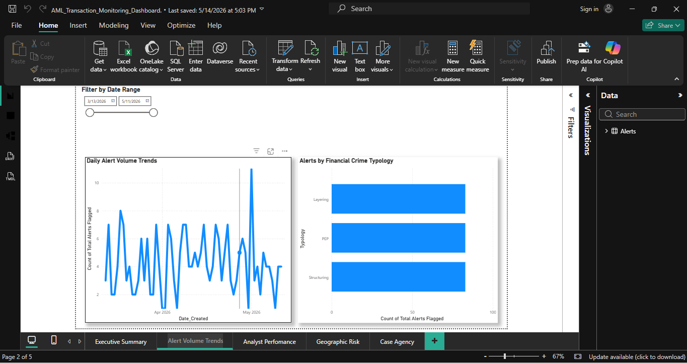
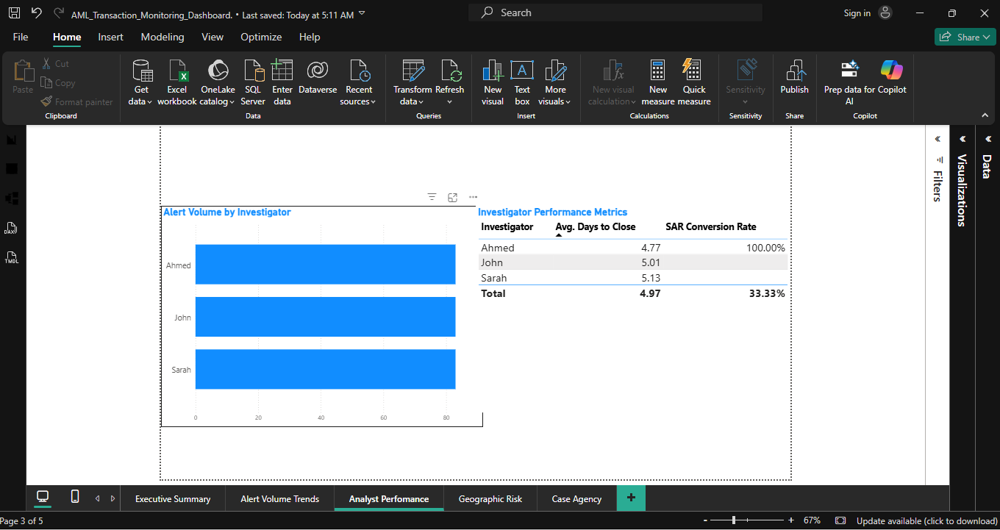
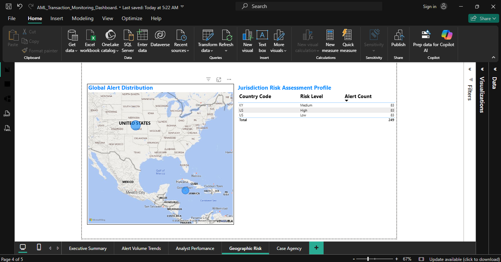
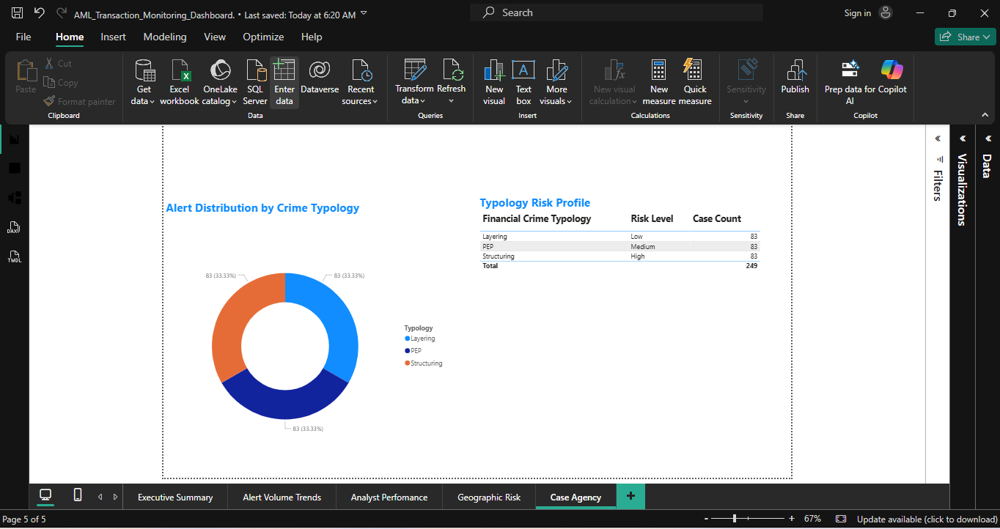

# AML Operations & Risk Intelligence Dashboard

## Introduction
In high-stakes financial compliance environments, operational backlogs directly expose institutions to systemic regulatory penalties and financial crime vulnerabilities. This project delivers an enterprise-ready, end-to-end Power BI data analytics solution that simulates a live Anti-Money Laundering (AML) Operations Center. 

The dashboard ingests, maps, and models mock financial intelligence data across 249 global alerts. It provides compliance management with immediate visibility into critical operational bottlenecks, systemic Service Level Agreement (SLA) breaches, analyst output capacity, geographic exposure, and legal case distributions.

---

## Technologies List
* **Data Visualization & Business Intelligence:** Microsoft Power BI Desktop
* **Data Storage & Engineering Source:** Microsoft Excel  
* **Analytical Calculation Engine:** Data Analysis Expressions (DAX)
* **Version Control:** Git & GitHub

---

## Features
* **Executive Performance Tracking:** Interactive Key Performance Indicators (KPIs) mapping case resolution rates and investigative conversions.
* **Dynamic Investigator Metrics:** High-fidelity matrix tracking individual investigator volume, average processing speed, and file quality scores.
* **Geospatial Risk Mapping:** Dynamic map visualization plotting alert volume exposure by international country codes, instantly exposing high-volume geographic hubs.
* **Typology Risk Matrices:** Granular operational profiles cross-referencing specific financial crime methods (Structuring, Layering, and Politically Exposed Persons) with alert severity volumes.

---

## Repository Dashboard Visuals

### Page 1 — Executive Summary
*Provides a high-level operational overview of total cases, open vs. closed resolution rates, critical SLA breaches, and overall SAR filing conversion performance.*
**

### Page 2 — Alert Volume Trends
*Displays case distribution over time and highlights high-risk financial crime categories to assist compliance managers with resource allocation.*
** 

### Page 3 — Analyst Performance
*Monitors operational throughput, investigative capacity, and file quality scores across the enforcement team.*
**

### Page 4 — Geographic Risk Assessment
*Maps operational alert density across international jurisdictions to isolate cross-border exposure risks.*
**

### Page 5 — Case Typology Analysis
*Breaks down the operational data cube by specific crime methods and risk categories, ensuring exact legal alignment.*
**

---

## Keyboard Shortcuts
To maximize layout precision, build efficiency, and alignment consistency during development, the following system commands were utilized:
* **`Ctrl + G`**: Group selected visuals to maintain unified sizing, card structures, and container borders.
* **`Alt + Shift + F10`**: Open context validation menus on selected data elements to check aggregation properties.
* **`Arrow Keys`**: Fine-tune pixel positioning of charts to guarantee symmetrical canvas grid lines.

---

## The Process
1. **Data Sheet Ingestion:** Generated an multi-sheet operational workbook (`aml_alerts_data.xlsx`) simulating real-world transaction monitoring variables, including timestamps, analyst names, and risk codes.
2. **Schema Calibration:** Configured data connections within Power BI, resolving column types, identifying unique row keys, and verifying proper data alignment.
3. **DAX Architecture:** Formulated performance measures to isolate underlying data signals without introducing row-context processing drag:
```dax
-- Suspicious Activity Report (SAR) Conversion Efficiency Rate
SAR Rate = 
DIVIDE(
    COUNTROWS(FILTER(Alerts, Alerts[Status] = "SAR")),
    COUNTROWS(Alerts)
) * 100

-- Operational Productivity Formula (Throughput per Investigator Day)
Productivity = 
DIVIDE(
    COUNTROWS(Alerts), 
    DISTINCTCOUNT(Alerts[Analyst_Name]) * DISTINCTCOUNT(Alerts[Date_Created])
)
